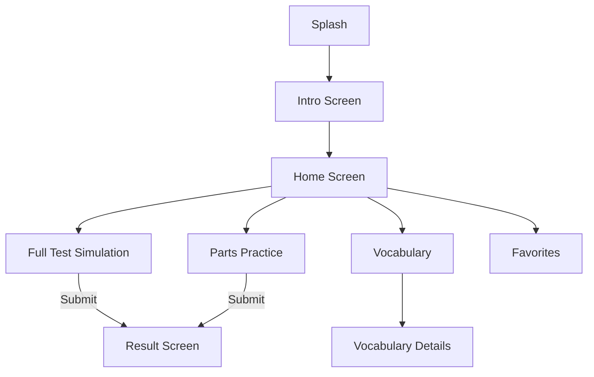

# TOEIC K Black

An Android application for practicing TOEIC skills, designed to help users prepare for the test efficiently with various practice modes and vocabulary tools.

## Tech Stack 🛠️

This project utilizes modern Android development tools and libraries:

*   **Language**: Kotlin
*   **Architecture**: MVVM (Model-View-ViewModel) with Single Activity approach
*   **Dependency Injection**: Hilt
*   **Asynchronous Processing**: Coroutines & Flow
*   **UI Components**:
    *   XML Layouts (ViewBinding)
    *   Material Design 3
*   **Navigation**: Jetpack Navigation Component
*   **Local Data**: Room Database
*   **Remote Data**: Retrofit 2 + OkHttp
*   **Image Loading**: Glide
*   **Other Libraries**:
    *   Shimmer (Loading effects)
    *   DotsIndicator
    *   LeakCanary (Memory leak detection in debug)
## Main Features ✨

*   **Full Test Simulation**: Simulate a real TOEIC exam environment.
*   **Part-wise Practice**: Focus on specific parts of the TOEIC test (Listening & Reading).
*   **Vocabulary Builder**: Specialized module for learning and reviewing TOEIC vocabulary.
*   **Favorites**: Bookmark difficult questions or words for later review.
*   **Crash Reporting**: Built-in "BugHandler" to capture and display errors.

## Activity Flow 🔄

## Author 👨‍💻

**khoa083**
